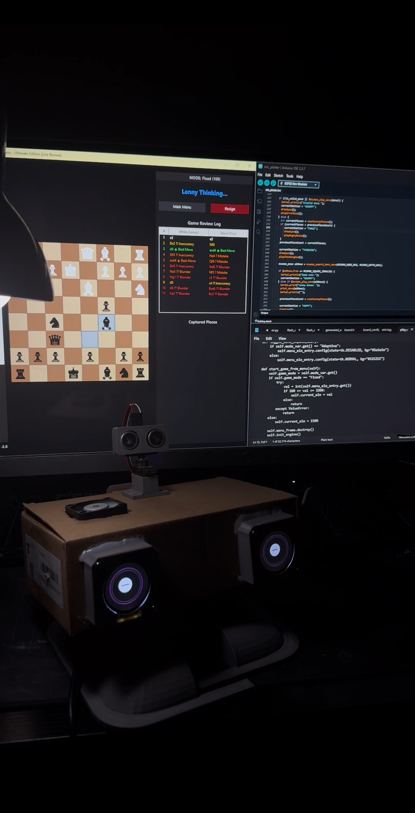
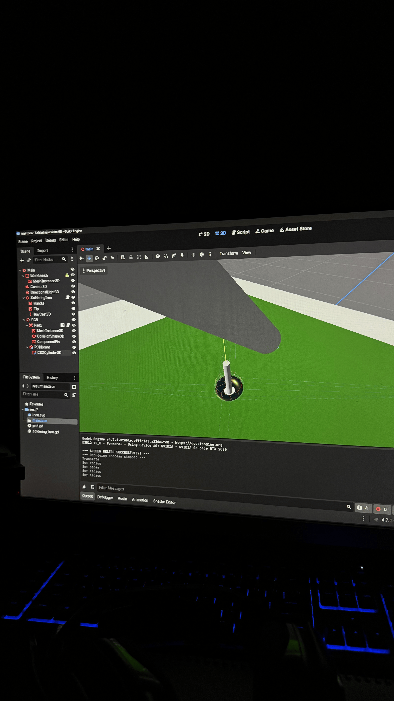
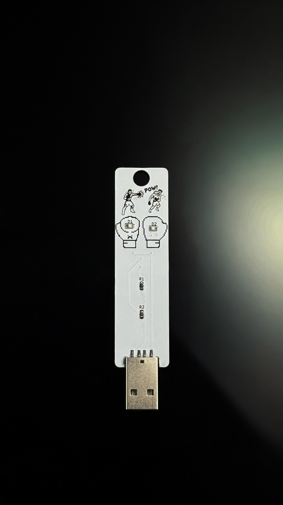

# Welcome to My Portfolio Hello! My name is GC.

## Projects

### ♟️ Lenny — Smart Chess & Interactive Bot

- **What Was Used:** ESP32, GC9A01 Round Displays, Piezo Speaker, MCU-MAX Chess Engine
- **Description:** An interactive desktop robot featuring dual round GC9A01 LCD eye displays for dynamic expressions, piezo audio feedback, and an integrated chess engine. 

### 🛠️ Interactive 3D Soldering Simulator 

- **What Was Used:** Godot Engine 4, GDScript   
- **Description:** A 3D soldering simulator featuring thermal transfer physics, solder wire melting, flux smoke particle systems, component lead trimming, and fume extraction mechanics.
 
### ⚡ Custom Boxing Gym LED Keychains 

- **What Was Used:** KiCad 9,  
- **Description:** Custom boxing-themed keychains designed on a custom printed circuit board in KiCad, powered via an integrated USB-A connector with edge-lit LEDs. 

---  

## About Me
[Click here to learn more → About Me](about.md) 

## Notebook
[Click here to go to my notebook → Notebook](notebook.md)
